# PrecisionLearnDerm 🎓

**AI-Powered Dermatology Board Exam Preparation Platform**

[](https://github.com)
[](https://ai.google.dev/)
[](https://firebase.google.com)
[](https://react.dev)

## 🚀 Overview

PrecisionLearnDerm is a sophisticated, AI-powered medical education platform designed specifically for dermatology board exam preparation. The system leverages **Google's Gemini 2.5 Pro** - Google's most intelligent AI model - to generate, review, and optimize high-quality medical questions that meet American Board of Dermatology (ABD) standards.

## ✨ Key Features

### **AI-Powered Question Generation**
- **Powered by Gemini 2.5 Pro**: Google's most advanced AI model for superior medical content generation
- **Multi-Agent Pipeline**: Three specialized AI agents (Drafting, Review, Scoring) ensure exceptional question quality
- **Medical Knowledge Base**: 4,299 dermatology entities with 1,692 high-quality entries
- **ABD Compliance**: Questions formatted to match board exam standards

### **Personalization Engine**
- **Adaptive Learning**: Spaced repetition system (SRS) for optimal retention
- **Performance Tracking**: Detailed analytics and progress monitoring
- **Difficulty Calibration**: Questions matched to individual skill levels
- **Weakness Targeting**: Focus on areas needing improvement

### **Clinical Excellence**
- **Realistic Vignettes**: Patient scenarios that mirror real clinical situations
- **Evidence-Based Content**: Questions backed by medical literature
- **Expert Review System**: Quality assurance through medical validation
- **Comprehensive Explanations**: Detailed rationales for all answers

## 🏗️ Architecture

### **Technology Stack**
- **Frontend**: React 19, TypeScript, Tailwind CSS, Zustand
- **Backend**: Firebase Cloud Functions (Node.js 20)
- **Database**: Cloud Firestore
- **AI Models**: Gemini 2.5 Pro (All AI agents)
- **Authentication**: Firebase Auth with role-based access
- **Hosting**: Firebase Hosting

### **AI Agent Pipeline**

```mermaid
graph LR
    A[Knowledge Base] --> B[Drafting Agent<br/>Gemini 2.5 Pro]
    B --> C[Review Agent<br/>Gemini 2.5 Pro]
    C --> D[Scoring Agent<br/>Gemini 2.5 Pro]
    D --> E[Quality Check]
    E -->|Score < 20| B
    E -->|Score ≥ 20| F[Question Bank]
```



## 📊 System Status

- **✅ 52 Cloud Functions Deployed**
- **✅ AI Pipeline Operational** (Gemini 2.5 Pro)
- **✅ Knowledge Base Loaded** (4,299 entities)
- **✅ Frontend Deployed**
- **✅ Authentication System Active**
- **✅ Admin Dashboard Functional**

## 🚀 Getting Started

### Prerequisites
- Node.js 20+
- Firebase CLI
- Google Cloud Project with Gemini API access

### Installation

1. **Clone the repository**
```bash
git clone https://github.com/yourusername/PrecisionLearnDerm.git
cd PrecisionLearnDerm
```

2. **Install dependencies**
```bash
# Install root dependencies
npm install

# Install functions dependencies
cd functions
npm install

# Install web dependencies
cd ../web
npm install
```

3. **Configure environment**
```bash
# Create .env file in functions directory
cd ../functions
echo "GEMINI_API_KEY=your-gemini-api-key" > .env
```

4. **Deploy to Firebase**
```bash
# From root directory
firebase deploy
```

### Local Development

1. **Start Firebase emulators**
```bash
firebase emulators:start
```

2. **Run frontend development server**
```bash
cd web
npm run dev
```

3. **Test AI Pipeline**
```bash
# Open the local testing UI
open ai-pipeline-tester-local.html
```

## 🧪 AI Pipeline Testing

The AI pipeline can be tested using the included testing interfaces:

- **`ai-pipeline-tester-local.html`** - Local emulator testing
- **`simple-ai-tester.html`** - Simplified testing interface
- **`cloud-function-seeder.html`** - Database seeding tool

All AI agents are powered by **Gemini 2.5 Pro** for optimal performance.

## 📁 Project Structure

```
PrecisionLearnDerm/
├── functions/          # Firebase Cloud Functions
│   ├── src/
│   │   ├── ai/        # AI agents (Gemini 2.5 Pro)
│   │   ├── admin/     # Admin functions
│   │   ├── items/     # Question management
│   │   ├── kb/        # Knowledge base
│   │   └── pe/        # Personalization engine
├── web/               # React frontend
│   ├── src/
│   │   ├── pages/     # Application pages
│   │   ├── components/# Reusable components
│   │   └── lib/       # Utilities and hooks
├── shared/            # Shared types
└── knowledge/         # Medical knowledge data
```

## 🔑 Key Components

### AI Agents (Powered by Gemini 2.5 Pro)
- **Drafting Agent**: Generates initial questions from knowledge base
- **Review Agent**: Validates medical accuracy and improves quality
- **Scoring Agent**: Evaluates questions against ABD standards

### Personalization Engine
- **Adaptive Generation**: Creates personalized question sets
- **SRS Algorithm**: Optimizes review scheduling
- **Performance Analytics**: Tracks learning progress

### Admin Dashboard
- **Question Management**: Review and approve AI-generated questions
- **Quality Control**: Monitor question performance metrics
- **User Analytics**: Track platform usage and outcomes

## 📈 Performance Metrics

- **Question Generation**: ~6 seconds per question
- **Quality Score Target**: ≥20/25 for approval
- **Knowledge Base**: 1,692 high-quality entities
- **AI Model**: Gemini 2.5 Pro (Google's most intelligent model)

## 🔐 Security

- **Authentication**: Firebase Auth with custom claims
- **Authorization**: Role-based access control (Student/Admin)
- **Data Protection**: Firestore security rules
- **API Security**: Cloud Function authentication

## 📝 Documentation

- [Product Architecture](./product_architecture.md)
- [System Analysis](./COMPREHENSIVE_SYSTEM_ANALYSIS.md)
- [Project Plan](./project_plan.md)
- [Change Logs](./change_logs.md)

## 🤝 Contributing

This is a proprietary medical education platform. For contribution guidelines, please contact the development team.

## 📄 License

Proprietary - All Rights Reserved

## 🙏 Acknowledgments

- **Google Gemini 2.5 Pro** - Powering our AI agents
- **Firebase** - Backend infrastructure
- **American Board of Dermatology** - Guidelines and standards

---

**Built with ❤️ for medical education excellence** 