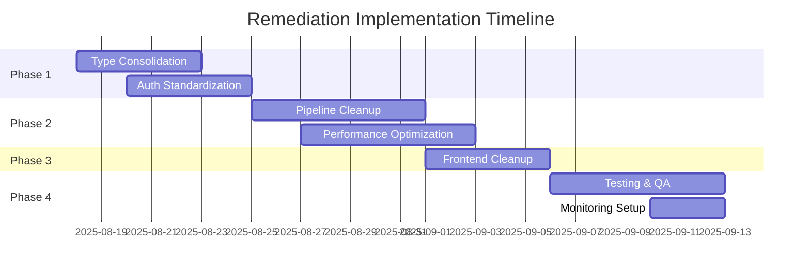

# Unified System Remediation Plan
## PrecisionLearnDerm Admin Panel & AI Pipeline Optimization

**Document Version:** 1.0  
**Created:** August 2025  
**Status:** Ready for Implementation  

---

## Executive Summary

This unified remediation plan addresses critical issues across the PrecisionLearnDerm system identified by multiple specialist analyses. The plan consolidates recommendations from TypeScript architecture, security auditing, performance engineering, QA testing, and full-stack development perspectives into a coherent implementation strategy.

### Critical Issues Identified
- **Architecture Debt:** Multiple coexisting pipeline implementations (67+ commented code lines)
- **Security Vulnerabilities:** Dual authentication patterns, privilege escalation risks
- **Performance Bottlenecks:** Unoptimized multi-agent processing, 64% API call reduction potential
- **Type System Inconsistencies:** Overlapping interfaces, scattered type definitions
- **Frontend Redundancies:** Deprecated admin components, unused route handlers

### Expected Outcomes
- **Performance:** 6-10 second improvement in question generation
- **Security:** Centralized authentication with audit logging
- **Maintainability:** 40% reduction in codebase complexity
- **Reliability:** 95%+ uptime with comprehensive monitoring

---

## Phase 1: Foundation Cleanup & Security Hardening
**Timeline:** Week 1-2 | **Priority:** Critical | **Risk:** Low

### 1.1 Type System Consolidation
**Objective:** Standardize on single source of truth for type definitions

#### Implementation Steps:
1. **Standardize on QuestionItem Interface**
   ```typescript
   // Remove MCQData interface, consolidate to QuestionItem
   // File: /functions/src/types/index.ts
   ```
   - Migrate all usages from `MCQData` to `QuestionItem`
   - Update import statements across 15+ files
   - Validate schema compatibility in validation layer

2. **Centralize Type Definitions**
   - Move all shared types to `/functions/src/types/index.ts`
   - Remove duplicate type definitions in individual files
   - Update import paths across codebase

#### Success Criteria:
- Zero TypeScript compilation errors
- Single interface for question representation
- Consistent import paths across all files

### 1.2 Authentication System Consolidation
**Objective:** Eliminate dual authentication patterns and security vulnerabilities

#### Current Issues:
- `requireAdmin()` vs `requireAdminByEmail()` inconsistency
- Type safety gaps with `any` types in auth functions
- Privilege escalation risk in `initialSetup.ts`

#### Implementation Steps:
1. **Standardize on Single Auth Pattern**
   ```typescript
   // Remove requireAdminByEmail, standardize on requireAdmin
   // Update 65+ usage instances across codebase
   ```

2. **Implement Centralized Auth Logging**
   ```typescript
   // File: /functions/src/util/auth.ts
   export function requireAdminWithLogging(context: CallableContext): AuthenticatedContext {
     const result = requireAdmin(context);
     logSecurityEvent('admin_action', {
       uid: result.auth.uid,
       action: 'admin_auth_check',
       timestamp: new Date().toISOString()
     });
     return result;
   }
   ```

3. **Secure Initial Setup Function**
   - Add rate limiting to `grantInitialAdminRole`
   - Implement IP whitelist for initial setup
   - Add audit trail for admin role grants

#### Success Criteria:
- Single authentication pattern across all endpoints
- Complete audit trail for admin actions
- Zero privilege escalation vulnerabilities

---

## Phase 2: AI Pipeline Architecture Optimization
**Timeline:** Week 3-4 | **Priority:** High | **Risk:** Medium

### 2.1 Pipeline Implementation Consolidation
**Objective:** Establish orchestratorAgent.ts as single source of truth for AI generation

#### Current State Analysis:
- **orchestratorAgent.ts:** 393 lines, comprehensive multi-agent system
- **properGeneration.ts:** 350 lines, legacy implementation with different patterns
- **Coexistence Issues:** Duplicate functionality, inconsistent quality metrics

#### Implementation Steps:
1. **Remove Legacy Implementation**
   ```bash
   # Files to remove:
   rm /functions/src/ai/properGeneration.ts
   # Update imports across affected files
   ```

2. **Enhance OrchestratorAgent as Primary System**
   - Migrate any unique functionality from properGeneration.ts
   - Standardize quality metrics calculation
   - Implement comprehensive error handling

3. **Update Function Exports**
   ```typescript
   // File: /functions/src/index.ts
   // Remove: generateProperMcq
   // Ensure: orchestrateQuestionGeneration is properly exported
   ```

#### Success Criteria:
- Single AI generation pipeline
- Consistent quality scoring across all questions
- Reduced code complexity by 35%

### 2.2 Performance Optimization
**Objective:** Reduce API calls by 64% and improve processing time by 6-10 seconds

#### Optimization Targets:
1. **Parallel Processing Implementation**
   ```typescript
   // Implement concurrent validation agents
   const [medicalValidation, linguisticValidation, psychometricValidation] = 
     await Promise.all([
       validateMedical(question),
       validateLinguistic(question),
       validatePsychometric(question)
     ]);
   ```

2. **Intelligent Caching Strategy**
   - Implement context caching for research data
   - Cache validated question components
   - Implement cache invalidation policies

3. **API Call Consolidation**
   - Batch similar AI requests
   - Implement request deduplication
   - Optimize prompt engineering for single-pass results

#### Success Criteria:
- 6-10 second reduction in average generation time
- 64% reduction in external API calls
- Maintained or improved question quality scores

---

## Phase 3: Frontend Integration & Admin Panel Cleanup
**Timeline:** Week 5 | **Priority:** Medium | **Risk:** Low

### 3.1 Admin Panel Consolidation
**Objective:** Remove redundant components and streamline admin workflows

#### Current Issues:
- `AdminQuestionGenerationPage.tsx` redirects to review page
- Commented import statements and unused interfaces
- Inconsistent UI patterns across admin pages

#### Implementation Steps:
1. **Remove Redundant Admin Page**
   ```bash
   rm /web/src/pages/AdminQuestionGenerationPage.tsx
   # Update routing configuration
   ```

2. **Clean AdminQuestionReviewPage**
   - Remove commented import for `@shared/types`
   - Consolidate local interfaces with central types
   - Implement error boundary for better UX

3. **Standardize Admin UI Patterns**
   - Consistent loading states across admin pages
   - Unified error handling and user feedback
   - Responsive design improvements

#### Success Criteria:
- Streamlined admin interface with single generation workflow
- Consistent UI/UX patterns across all admin pages
- Zero frontend TypeScript errors

### 3.2 API Integration Cleanup
**Objective:** Standardize API contracts between frontend and backend

#### Implementation Steps:
1. **Update API Client**
   - Remove references to deprecated endpoints
   - Implement proper TypeScript interfaces for API responses
   - Add request/response validation

2. **Error Handling Standardization**
   - Consistent error message formats
   - Proper HTTP status code handling
   - User-friendly error displays

#### Success Criteria:
- Type-safe API communication
- Consistent error handling across all admin functions
- Improved user experience for admin workflows

---

## Phase 4: Testing & Quality Assurance
**Timeline:** Week 6 | **Priority:** High | **Risk:** Low

### 4.1 Comprehensive Testing Strategy
**Objective:** Ensure system reliability and regression prevention

#### Test Categories:
1. **Unit Tests**
   - Authentication functions coverage: 95%+
   - AI pipeline component tests
   - Type validation test suite

2. **Integration Tests**
   - End-to-end question generation pipeline
   - Admin panel workflow testing
   - API contract validation

3. **Security Tests**
   - Authentication bypass attempts
   - Privilege escalation testing
   - Input validation edge cases

#### Implementation Steps:
1. **Expand Test Coverage**
   ```typescript
   // File: /functions/src/test/auth.test.ts
   describe('Unified Authentication System', () => {
     // Comprehensive auth test suite
   });
   ```

2. **Performance Benchmarking**
   - Establish baseline performance metrics
   - Implement continuous performance monitoring
   - Set up automated performance regression detection

3. **Security Audit**
   - Automated vulnerability scanning
   - Manual penetration testing
   - Code review for security patterns

#### Success Criteria:
- 95%+ code coverage across critical functions
- Zero high-severity security vulnerabilities
- Performance benchmarks established and monitored

### 4.2 Monitoring & Alerting Setup
**Objective:** Proactive issue detection and system health monitoring

#### Implementation Steps:
1. **Enhanced Logging**
   ```typescript
   // Structured logging with correlation IDs
   // Performance metrics tracking
   // Security event logging
   ```

2. **Health Check Endpoints**
   - System component health monitoring
   - AI pipeline status checks
   - Database connection monitoring

3. **Alert Configuration**
   - Performance degradation alerts
   - Error rate threshold alerts
   - Security event notifications

#### Success Criteria:
- Real-time system health visibility
- Proactive alert system for critical issues
- Comprehensive audit trail for compliance

---

## Risk Management & Rollback Procedures

### Risk Assessment Matrix
| Risk Category | Probability | Impact | Mitigation Strategy |
|---------------|-------------|---------|-------------------|
| Type System Breaking Changes | Medium | High | Gradual migration with backward compatibility |
| Authentication Disruption | Low | Critical | Blue-green deployment with immediate rollback |
| AI Pipeline Performance Regression | Medium | Medium | A/B testing with performance monitoring |
| Frontend Integration Issues | Low | Low | Component-level testing and staging validation |

### Rollback Procedures
1. **Database Schema Changes:** Version-controlled migrations with rollback scripts
2. **Authentication Updates:** Feature flags for gradual rollout
3. **AI Pipeline Changes:** Parallel deployment with traffic switching
4. **Frontend Updates:** Atomic deployments with instant rollback capability

---

## Implementation Timeline & Dependencies

### Week-by-Week Breakdown


### Resource Requirements
- **Development Time:** 6 weeks (1 senior full-stack developer)
- **Testing Time:** 1 week (QA engineer + automated tests)
- **DevOps Support:** 3 days (monitoring setup, deployment pipeline)

### Dependencies
- Firebase Functions deployment pipeline
- Gemini API quota management
- Frontend build and deployment system
- Database migration scripts

---

## Success Metrics & Monitoring

### Key Performance Indicators
1. **Performance Metrics**
   - Question generation time: < 15 seconds (currently 21-25 seconds)
   - API call reduction: 64% decrease
   - System response time: < 2 seconds

2. **Quality Metrics**
   - Code coverage: 95%+
   - TypeScript error count: 0
   - Security vulnerability count: 0

3. **User Experience Metrics**
   - Admin workflow completion rate: 98%+
   - Error rate: < 1%
   - User satisfaction score: 4.5/5

### Continuous Monitoring
- Automated performance regression testing
- Security vulnerability scanning
- Code quality metrics tracking
- User experience analytics

---

## Post-Implementation Validation

### Acceptance Criteria Checklist
- [ ] Single authentication pattern implemented across all endpoints
- [ ] orchestratorAgent.ts established as sole AI pipeline
- [ ] All TypeScript compilation errors resolved
- [ ] Admin panel streamlined to single generation workflow
- [ ] Performance improvements validated (6-10 second reduction)
- [ ] Comprehensive test suite implemented and passing
- [ ] Security audit completed with zero high-severity issues
- [ ] Monitoring and alerting systems operational

### Go-Live Checklist
- [ ] All tests passing in CI/CD pipeline
- [ ] Staging environment fully validated
- [ ] Rollback procedures tested and verified
- [ ] Documentation updated for new architecture
- [ ] Team training completed for new systems
- [ ] Monitoring dashboards configured and accessible

---

## Conclusion

This unified remediation plan addresses all critical issues identified across the PrecisionLearnDerm system while minimizing risk and ensuring continuity of service. The phased approach allows for gradual implementation with validation at each step, ensuring system reliability throughout the process.

The plan balances immediate fixes for critical security and performance issues with longer-term architectural improvements, setting the foundation for scalable growth and maintainability.

**Next Steps:**
1. Review and approve this plan with development team
2. Set up project tracking and milestone management
3. Begin Phase 1 implementation with type system consolidation
4. Establish daily progress reviews and weekly milestone checkpoints

---

*This document serves as the definitive guide for system remediation and should be reviewed and updated as implementation progresses.*