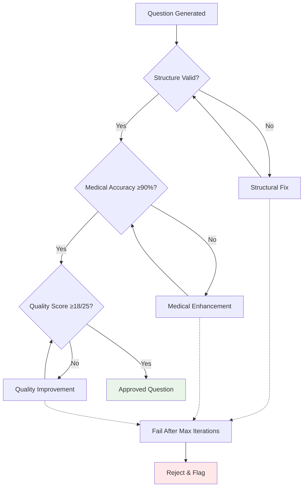

# Quality Standards & Validation Framework

**Version**: 2.0  
**Last Updated**: 2025-08-15  
**Status**: Production Standards

## Overview

The PrecisionLearnDerm quality assurance system implements rigorous standards to ensure all generated questions meet professional medical education requirements. This document outlines the comprehensive validation framework, quality gates, and benchmarks used to maintain excellence.

## Quality Standards Hierarchy

### Medical Education Standards
1. **American Board of Dermatology (ABD) Guidelines**
2. **Medical Education Best Practices**
3. **Clinical Evidence Standards**
4. **Professional Assessment Criteria**

### Quality Gate System



## Quality Metrics & Thresholds

### Primary Quality Standards

| Standard | Minimum | Target | Excellent | Critical |
|----------|---------|---------|-----------|----------|
| **Medical Accuracy** | 85% | 90% | 95% | 100% |
| **Structure Score** | 75/100 | 85/100 | 90/100 | 95/100 |
| **ABD Compliance** | 70/100 | 80/100 | 85/100 | 90/100 |
| **Overall Quality** | 15/25 | 18/25 | 20/25 | 23/25 |
| **Coherence Rate** | 80% | 85% | 90% | 95% |

### Quality Classification

#### Excellent (23-25/25)
- **Medical Accuracy**: 95%+ with expert-level precision
- **Clinical Realism**: Sophisticated, multi-layered scenarios
- **Educational Value**: Teaches complex concepts effectively
- **ABD Alignment**: Perfect board exam format compliance

#### Good (20-22/25)
- **Medical Accuracy**: 90-94% with reliable correctness
- **Clinical Realism**: Well-developed patient scenarios
- **Educational Value**: Clear learning objectives
- **ABD Alignment**: Strong format compliance

#### Acceptable (18-19/25)
- **Medical Accuracy**: 85-89% with minor issues
- **Clinical Realism**: Basic but adequate scenarios
- **Educational Value**: Meets minimum learning standards
- **ABD Alignment**: Adequate format compliance

#### Needs Improvement (<18/25)
- **Medical Accuracy**: <85% with significant issues
- **Clinical Realism**: Incomplete or unrealistic scenarios
- **Educational Value**: Limited learning benefit
- **ABD Alignment**: Format deficiencies

## Detailed Validation Rules

### 1. Question Structure Validation

#### Stem Requirements
```typescript
interface StemValidation {
  length: {
    minimum: 50,
    maximum: 500,
    optimal: 150-250
  };
  content: {
    patientDemographics: boolean;    // Age, gender, race when relevant
    chiefComplaint: boolean;         // Primary presenting concern
    historyDuration: boolean;        // Timeline of symptoms
    clinicalFindings: boolean;       // Physical examination results
    pertinentNegatives: boolean;     // Rule out differentials
    specificDetails: boolean;        // Measurable findings (sizes, locations)
  };
  clinicalRealism: {
    logicalProgression: boolean;     // Symptoms follow medical logic
    appropriateComplexity: boolean;  // Matches difficulty level
    culturalSensitivity: boolean;    // Appropriate demographics
  };
}
```

**Scoring Criteria:**
- **Perfect (25/25)**: All elements present with medical accuracy
- **Good (20-24)**: Most elements with minor gaps
- **Adequate (15-19)**: Core elements present
- **Poor (<15)**: Missing critical components

#### Lead-in Validation
```typescript
interface LeadInValidation {
  format: {
    isQuestion: boolean;             // Ends with question mark
    directness: boolean;             // Clear, unambiguous
    appropriateType: boolean;        // Matches question category
  };
  types: [
    'What is the most likely diagnosis?',
    'Which of the following is the best treatment?',
    'What is the next best step in management?',
    'Which finding is most characteristic of this condition?',
    'What is the most appropriate initial intervention?'
  ];
  clarity: {
    singleFocus: boolean;           // Tests one concept
    unambiguous: boolean;           // No multiple interpretations
    professionally_worded: boolean; // Medical terminology
  };
}
```

#### Options Validation
```typescript
interface OptionsValidation {
  structure: {
    count: 5;                       // Exactly five options
    uniqueness: boolean;            // No duplicates
    parallelism: boolean;           // Consistent grammatical structure
    length: {
      minimum: 3,
      maximum: 150,
      consistency: boolean          // Similar lengths
    };
  };
  correctAnswer: {
    count: 1;                       // Exactly one correct
    defendable: boolean;            // Clearly best answer
    evidence_based: boolean;        // Supported by literature
  };
  distractors: {
    plausibility: boolean;          // Could be considered
    homogeneity: boolean;          // Same category as correct
    medical_validity: boolean;      // Not medically impossible
    educational_value: boolean;     // Teach through elimination
  };
}
```

#### Explanation Validation
```typescript
interface ExplanationValidation {
  content: {
    correctAnswerRationale: boolean;   // Why answer is correct
    distractorExplanation: boolean;    // Why others are wrong
    clinicalPearls: boolean;           // Key learning points
    references: boolean;               // Evidence basis (when appropriate)
  };
  quality: {
    length: {
      minimum: 100,
      maximum: 1000,
      optimal: 200-400
    };
    clarity: boolean;                  // Easy to understand
    completeness: boolean;             // Addresses all options
    educational_value: boolean;        // Enhances learning
  };
}
```

### 2. Medical Accuracy Standards

#### Clinical Validation Framework
```typescript
interface MedicalAccuracyCheck {
  diagnosticAccuracy: {
    symptomDiagnosisAlignment: boolean;    // Symptoms match diagnosis
    epidemiologyConsistency: boolean;      // Patient demographics fit
    clinicalPresentationRealism: boolean;  // Realistic scenario
    differentialConsideration: boolean;    // Appropriate alternatives
  };
  therapeuticAccuracy: {
    treatmentAppropriateness: boolean;     // Evidence-based therapy
    doseAccuracy: boolean;                 // Correct medications/doses
    contraindicationAwareness: boolean;    // Safety considerations
    timelineRealism: boolean;              // Appropriate treatment duration
  };
  proceduralAccuracy: {
    indicationAppropriate: boolean;        // Procedure warranted
    techniqueCorrect: boolean;             // Proper methodology
    complicationAwareness: boolean;        // Risk recognition
    alternativeConsidered: boolean;        // Other options addressed
  };
}
```

#### Common Medical Issues Detected
```typescript
const MEDICAL_VALIDATION_RULES = [
  {
    category: 'Diagnostic Consistency',
    rules: [
      {
        check: 'melanoma_with_benign_treatment',
        error: 'Melanoma requires surgical excision, not topical therapy',
        severity: 'critical'
      },
      {
        check: 'psoriasis_with_antibiotics',
        error: 'Psoriasis is not infectious and does not respond to antibiotics',
        severity: 'major'
      },
      {
        check: 'emergency_without_urgency',
        error: 'Emergency presentations require immediate interventions',
        severity: 'major'
      }
    ]
  },
  {
    category: 'Treatment Appropriateness',
    rules: [
      {
        check: 'topical_steroid_strength',
        error: 'Steroid potency should match anatomical location',
        severity: 'moderate'
      },
      {
        check: 'systemic_therapy_indication',
        error: 'Systemic therapy requires appropriate severity',
        severity: 'major'
      }
    ]
  }
];
```

### 3. ABD Compliance Standards

#### Board Exam Format Requirements
```typescript
interface ABDComplianceCheck {
  questionStructure: {
    typeAFormat: boolean;              // Stem + lead-in + options
    clinicalVignette: boolean;         // Real patient scenario
    bottomUpApproach: boolean;         // Findings → diagnosis
    coverOptionsRule: boolean;         // Answerable without options
  };
  cognitiveLevel: {
    clinicalReasoning: boolean;        // Not mere recall
    applicationLevel: boolean;         // Apply knowledge
    synthesisRequired: boolean;        // Integrate information
    analysisDepth: boolean;           // Evaluate alternatives
  };
  professionalStandards: {
    evidenceBased: boolean;           // Current medical knowledge
    clinicallyRelevant: boolean;      // Important for practice
    educationallySound: boolean;      // Good learning tool
    culturallySensitive: boolean;     // Appropriate demographics
  };
  difficulty: {
    targetResponseRate: '70-80%';     // Neither too easy nor hard
    appropriateComplexity: boolean;   // Matches intended level
    cognitiveLoad: boolean;          // Manageable information
  };
}
```

## Quality Assurance Process

### Automated Validation Pipeline

#### Stage 1: Pre-Generation Validation
```typescript
async function preGenerationCheck(request: GenerationRequest): Promise<ValidationResult> {
  return {
    topicValidation: await validateTopic(request.topic),
    difficultyCheck: await validateDifficulty(request.difficulty),
    knowledgeBaseAccess: await checkKnowledgeBase(request.topic),
    apiKeyStatus: await verifyApiKey()
  };
}
```

#### Stage 2: Post-Generation Validation
```typescript
async function postGenerationValidation(question: GeneratedQuestion): Promise<QualityReport> {
  const validationResults = await Promise.all([
    validateStructure(question),
    checkMedicalAccuracy(question),
    assessABDCompliance(question),
    evaluateEducationalValue(question)
  ]);
  
  return {
    overallScore: calculateOverallScore(validationResults),
    detailedMetrics: validationResults,
    recommendations: generateRecommendations(validationResults),
    approvalStatus: determineApproval(validationResults)
  };
}
```

#### Stage 3: Iterative Improvement
```typescript
async function improveQuestion(
  question: GeneratedQuestion,
  qualityReport: QualityReport
): Promise<ImprovedQuestion> {
  const improvements = [];
  
  // Fix critical errors
  if (qualityReport.criticalIssues.length > 0) {
    question = await fixCriticalIssues(question, qualityReport.criticalIssues);
    improvements.push('Fixed critical medical accuracy issues');
  }
  
  // Enhance structure
  if (qualityReport.structureScore < 85) {
    question = await enhanceStructure(question);
    improvements.push('Improved question structure');
  }
  
  // Improve medical accuracy
  if (qualityReport.medicalAccuracy < 90) {
    question = await enhanceMedicalAccuracy(question);
    improvements.push('Enhanced medical accuracy');
  }
  
  return { question, improvements };
}
```

### Manual Review Process

#### Expert Review Criteria
1. **Medical Accuracy Review**
   - Clinical scenario realism
   - Treatment appropriateness
   - Diagnostic accuracy
   - Literature alignment

2. **Educational Value Assessment**
   - Learning objective clarity
   - Concept difficulty appropriateness
   - Teaching effectiveness
   - Retention potential

3. **Professional Standards Review**
   - ABD guideline compliance
   - Cultural sensitivity
   - Ethical considerations
   - Professional terminology

## Performance Benchmarks

### System Performance Standards

#### Response Time Benchmarks
- **Standard Generation**: <2 seconds (95th percentile)
- **Enhanced Pipeline**: <3 seconds (95th percentile)
- **Validation Only**: <500ms (95th percentile)
- **Medical Accuracy Check**: <200ms (95th percentile)

#### Success Rate Targets
- **Generation Success**: >99% (infrastructure reliability)
- **Validation Pass**: >95% (quality achievement)
- **Medical Accuracy Pass**: >90% (clinical correctness)
- **ABD Compliance Pass**: >85% (format adherence)

### Quality Trending Analysis

#### Daily Quality Metrics
```typescript
interface DailyQualityReport {
  date: string;
  questionsGenerated: number;
  averageQualityScore: number;
  medicalAccuracyRate: number;
  structurePassRate: number;
  abdComplianceRate: number;
  topPerformingTopics: string[];
  improvementOpportunities: string[];
}
```

#### Weekly Quality Review
- **Quality Score Trending**: Monitor week-over-week improvements
- **Topic Performance Analysis**: Identify consistently high/low performing areas
- **Medical Accuracy Patterns**: Track common accuracy issues
- **User Feedback Integration**: Incorporate user ratings and feedback

## Continuous Improvement Framework

### Quality Feedback Loop
1. **User Rating Collection**: Gather feedback on question quality
2. **Performance Analysis**: Correlate user success with question metrics
3. **Pattern Recognition**: Identify systematic improvement opportunities
4. **Model Refinement**: Enhance generation algorithms based on insights

### Knowledge Base Enhancement
1. **Content Accuracy Review**: Verify KB information against current literature
2. **Completeness Assessment**: Identify gaps in dermatology coverage
3. **Quality Score Recalibration**: Update scoring based on performance data
4. **New Topic Integration**: Add emerging dermatology topics and treatments

### Validation Rule Evolution
1. **Medical Knowledge Updates**: Incorporate new clinical guidelines
2. **Educational Standard Changes**: Adapt to evolving teaching methods
3. **User Feedback Integration**: Refine rules based on educator input
4. **Performance Optimization**: Streamline validation for efficiency

## Quality Reporting & Analytics

### Real-Time Quality Dashboard
- **Current Quality Score**: Live average across all generated questions
- **Medical Accuracy Rate**: Real-time clinical correctness percentage
- **Validation Pass Rate**: Success rate through quality gates
- **Topic Performance Heat Map**: Visual representation of topic quality

### Quality Trend Analysis
- **Historical Quality Trends**: Track improvements over time
- **Comparative Analysis**: Compare performance across topics and difficulty levels
- **Predictive Modeling**: Forecast quality trends based on current patterns
- **Alert System**: Notify when quality metrics fall below thresholds

### Compliance Reporting
- **ABD Compliance Tracking**: Monitor adherence to board exam standards
- **Medical Education Standards**: Track alignment with professional guidelines
- **Quality Assurance Audits**: Regular comprehensive quality assessments
- **Improvement Action Plans**: Systematic quality enhancement initiatives

## Conclusion

The Quality Standards & Validation Framework ensures that PrecisionLearnDerm maintains the highest standards in medical education content generation. Through comprehensive automated validation, iterative improvement processes, and continuous monitoring, the system delivers consistently high-quality, medically accurate, and educationally valuable dermatology board exam questions.