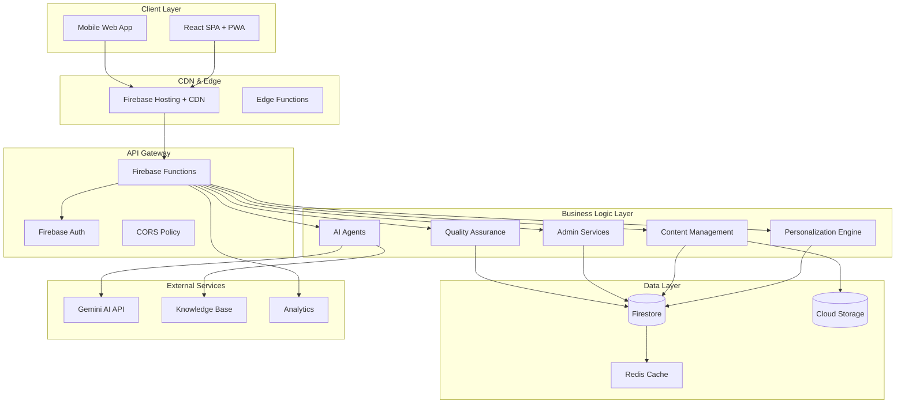
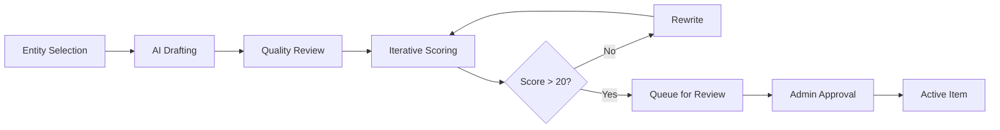
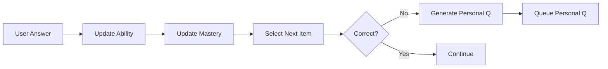
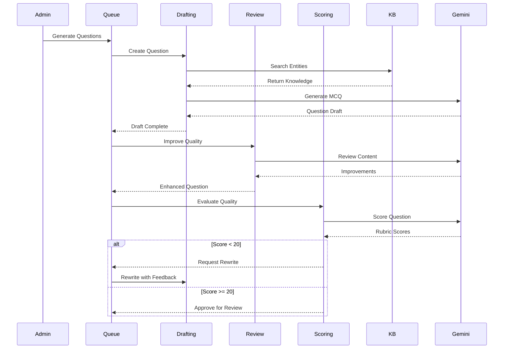
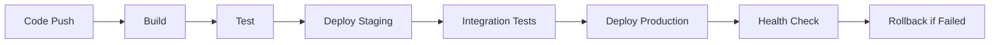

# PrecisionLearnDerm - Product Architecture

## 🏗️ **SYSTEM OVERVIEW**

PrecisionLearnDerm is a comprehensive AI-powered dermatology board exam preparation platform built on modern cloud-native architecture with advanced personalization and content generation capabilities.

### **Core Principles**
- **Microservices Architecture**: Modular, scalable, and maintainable
- **AI-First Design**: Intelligent content generation and personalization
- **Evidence-Based Learning**: Medical accuracy and validated content
- **Progressive Enhancement**: Works across all devices and network conditions
- **Privacy-First**: HIPAA-compliant data handling and user privacy

---

## 🎯 **ARCHITECTURE DIAGRAM**



---

## 🖥️ **FRONTEND ARCHITECTURE**

### **Technology Stack**
- **Framework**: React 18 with TypeScript
- **Build Tool**: Vite for fast development and optimized builds
- **Styling**: Tailwind CSS with custom design system
- **State Management**: Zustand with persistence middleware
- **Routing**: React Router v6 with lazy loading
- **Animation**: Framer Motion for smooth transitions
- **Icons**: Lucide React for consistent iconography

### **Component Architecture**

#### **1. Application Shell** (`/src/App.tsx`)
```typescript
App
├── ErrorBoundary (Global error handling)
├── Suspense (Loading states)
├── AnimatePresence (Route transitions)
└── Routes
    ├── PublicRoutes (Landing, Auth)
    ├── ProtectedRoutes (Dashboard, Quiz, Profile)
    └── AdminRoutes (Management interfaces)
```

#### **2. Page Components** (`/src/pages/`)
- **Public Pages**: Landing, Authentication
- **User Pages**: Dashboard, Quiz flow, Performance, Profile
- **Learning Pages**: Flashcards, Mock Exam, Patient Simulation
- **Admin Pages**: Question management, Analytics, System health

#### **3. Shared Components** (`/src/components/`)
- **UI Primitives**: Buttons, Inputs, Cards, Modals
- **Quiz Engine**: QuizRunner, BatchQuizRunner, QuestionFeedback
- **Navigation**: Navigation bars, Breadcrumbs, Admin tabs
- **Data Display**: Charts, Tables, Performance metrics

#### **4. Business Logic** (`/src/lib/`)
- **API Client**: Firebase Functions integration
- **Authentication**: User management and profile handling
- **State Management**: Zustand store configuration
- **Utilities**: Data formatting, validation, helpers

### **State Architecture**

#### **Zustand Store Structure**
```typescript
interface AppStore {
  // Authentication & User Data
  authUser: User | null;
  profile: UserProfile | null;
  profileLoading: boolean;
  
  // Quiz State (Persisted)
  activeQuiz: {
    config: QuizConfig;
    currentIndex: number;
    answers: QuizAnswer[];
    startTime: number;
  };
  
  // UI State (Ephemeral)
  sidebarOpen: boolean;
  currentTheme: 'light' | 'dark';
  notifications: Notification[];
}
```

#### **Data Flow Pattern**
1. **User Action** → Component Event Handler
2. **Event Handler** → API Call or Store Update
3. **API Response** → Store Update
4. **Store Change** → Component Re-render
5. **Component** → Updated UI

---

## ⚙️ **BACKEND ARCHITECTURE**

### **Technology Stack**
- **Runtime**: Node.js 18 with TypeScript
- **Platform**: Firebase Cloud Functions (1st Generation)
- **Database**: Firestore (NoSQL document database)
- **Storage**: Firebase Cloud Storage
- **Authentication**: Firebase Auth with custom claims
- **AI Integration**: Google Gemini 2.5 Pro API (Google's most intelligent AI model)

### **Microservices Structure**

#### **1. AI Services** (`/src/ai/`)
```
ai/
├── drafting.ts      # Question generation with Gemini
├── review.ts        # Content quality improvement
├── scoring.ts       # Psychometric evaluation
└── tutor.ts         # Intelligent tutoring system
```

**Capabilities**:
- **Drafting Agent**: Generates board-style questions using medical knowledge
- **Review Agent**: Improves question quality and medical accuracy
- **Scoring Agent**: Evaluates questions using 5-criterion rubric (25 points)
- **Tutor Agent**: Provides explanations with knowledge base citations

#### **2. Personalization Engine** (`/src/pe/`)
```
pe/
├── ability.ts           # Elo rating system
├── nextItem.ts         # Item selection algorithm
├── nextItems.ts        # Batch item selection
├── srs.ts              # Spaced repetition scheduling
├── adaptiveGeneration.ts # Personal question creation
└── qualityRetirement.ts  # Question quality management
```

**Algorithms**:
- **Elo Rating**: Dynamic ability assessment (θ parameter)
- **Bayesian Knowledge Tracing**: Topic mastery probability
- **FSRS Algorithm**: Optimized spaced repetition scheduling
- **Adaptive Selection**: Difficulty matching with exploration

#### **3. Content Management** (`/src/items/`)
```
items/
├── get.ts       # Item retrieval and filtering
├── propose.ts   # Draft item creation
├── revise.ts    # Item modification requests
└── promote.ts   # Draft to active promotion
```

**Workflow**:
1. **Draft Creation** → Structured content proposal
2. **AI Review** → Quality improvement and validation
3. **Human Review** → Expert evaluation and approval
4. **Promotion** → Active item deployment
5. **Quality Monitoring** → Ongoing performance tracking

#### **4. Admin Services** (`/src/admin/`)
```
admin/
├── questionQueue.ts    # AI-generated question review
├── taxonomy.ts         # Content categorization
├── importQuestions.ts  # Legacy content migration
└── analytics.ts        # System performance metrics
```

#### **5. Knowledge Base** (`/src/kb/`)
```
kb/
├── knowledgeBase.json  # 4,299 dermatology entities
├── search.ts           # Knowledge retrieval
└── validation.ts       # Medical accuracy checking
```

### **Data Processing Pipeline**

#### **Question Generation Workflow**


#### **Personalization Workflow**


---

## 🗄️ **DATA ARCHITECTURE**

### **Firestore Collections Structure**

#### **1. Users Collection** (`users/{uid}`)
```typescript
interface UserDocument {
  // Profile
  displayName: string;
  email: string;
  photoURL?: string;
  createdAt: Timestamp;
  
  // Learning Preferences
  preferences: {
    learningPace: 'slow' | 'steady' | 'medium' | 'fast' | 'accelerated';
    darkMode: boolean;
    emailSummary: boolean;
    quizConfidenceAssessment: boolean;
  };
  
  // Performance Metrics
  stats: {
    quizzesTaken: number;
    averageScore: number;
    streak: number;
    lastStudiedAt: Timestamp | null;
  };
  
  // Personalization Data
  ability: {
    theta: number;           // Elo ability parameter
    lastUpdate: Timestamp;
  };
  
  // Topic Mastery (BKT)
  mastery: Record<string, {
    pMastery: number;        // Probability of mastery
    lastUpdate: Timestamp;
  }>;
  
  // Recent Items (Anti-repetition)
  recentItems: Record<string, number>; // itemId -> timestamp
  
  // Adaptive Queue
  adaptiveQueue: {
    pendingQuestions: string[];
    lastGenerated: Timestamp;
  };
}
```

#### **2. Items Collection** (`items/{itemId}`)
```typescript
interface ItemDocument {
  // Content
  type: 'mcq';
  stem: string;
  leadIn: string;
  options: Array<{ text: string }>;
  keyIndex: number;
  explanation: string;
  
  // Metadata
  status: 'active' | 'draft' | 'retired';
  topicIds: string[];
  category: string;
  subcategory: string;
  primaryTopic: string;
  domain: string;
  
  // Psychometrics
  difficulty: number;        // β parameter (0-1)
  qualityScore: number;      // 0-100
  qualityIndicators: {
    medicalAccuracy: number;
    clarity: number;
    realism: number;
    educationalValue: number;
  };
  
  // Telemetry
  telemetry: {
    attempts: number;
    avgTimeSec: number;
    p2TimeSec: number;       // 2nd percentile
    p98TimeSec: number;      // 98th percentile
    times: number[];
    avgRating?: number;
  };
  
  // Provenance
  source: 'legacy_question_bank' | 'ai_generated' | 'manual_entry';
  createdBy: string;
  createdAt: Timestamp;
  updatedAt: Timestamp;
}
```

#### **3. Quiz Attempts** (`quizzes/{uid}/attempts/{attemptId}`)
```typescript
interface QuizAttempt {
  startedAt: Timestamp;
  finishedAt: Timestamp;
  durationSec: number;
  score: number;
  
  items: Array<{
    itemRef: DocumentReference;
    topicIds: string[];
    chosenIndex: number;
    correctIndex: number;
    correct: boolean;
    confidence: number;
    timeToAnswerSec: number;
    
    ratings: {
      question: number;      // 1-5 stars
      explanation: number;   // 1-5 stars
      reasons: string[];
    };
    
    note?: string;
  }>;
}
```

#### **4. Personal Questions** (`users/{uid}/personalQuestions/{pqId}`)
```typescript
interface PersonalQuestion {
  // Content (same as Item)
  stem: string;
  leadIn: string;
  options: Array<{ text: string }>;
  keyIndex: number;
  explanation: string;
  
  // Personalization
  topicIds: string[];
  gapTargeted: {
    topic: string;
    gapType: 'conceptual' | 'application' | 'recall';
    severity: number;
    evidence: string;
  };
  focusArea: string;
  
  // Generation
  difficulty: number;
  generatedAt: Timestamp;
  triggeredBy: string;      // itemId that triggered generation
}
```

### **Indexing Strategy**

#### **Performance-Critical Indexes**
```javascript
// Compound indexes for efficient queries
[
  { collection: 'items', fields: ['status', 'topicIds', 'difficulty'] },
  { collection: 'items', fields: ['status', 'primaryTopic', 'qualityScore'] },
  { collection: 'users', fields: ['email', 'createdAt'] },
  { collection: 'quizzes', fields: ['uid', 'finishedAt'] },
  { collection: 'questionFeedback', fields: ['itemId', 'createdAt'] }
]
```

---

## 🤖 **AI INTEGRATION ARCHITECTURE**

### **Gemini API Integration**
```typescript
interface GeminiConfig {
  model: 'gemini-2.5-pro'; // Google's most intelligent AI model
  temperature: 0.2 | 0.7;      // Conservative for scoring, creative for generation
  maxOutputTokens: 2048 | 3072;
  responseMimeType: 'application/json';
  safetySettings: SafetySetting[];
}
```

### **Multi-Agent Pipeline**

#### **Agent Coordination**


### **Knowledge Base Architecture**

#### **Entity Structure**
```typescript
interface KnowledgeEntity {
  name: string;
  description: string;
  symptoms: string;
  treatment: string;
  diagnosis: string;
  causes: string;
  prognosis: string;
  complications: string;
  prevention: string;
  completeness_score: number;  // 0-100
  last_updated: string;
  source: string;
}
```

#### **Search & Retrieval**
- **Semantic Matching**: TF-IDF with context awareness
- **Quality Filtering**: Completeness score > 65
- **Relevance Scoring**: Multi-factor relevance calculation
- **Caching**: Frequently accessed entities cached in memory

---

## 🔐 **SECURITY ARCHITECTURE**

### **Authentication & Authorization**

#### **Firebase Auth Integration**
```typescript
interface CustomClaims {
  role: 'user' | 'admin' | 'reviewer';
  verified: boolean;
  institution?: string;
  specialties?: string[];
}
```

#### **Access Control Matrix**
| Resource | User | Admin | Reviewer |
|----------|------|-------|----------|
| Quiz Content | Read | Full | Read |
| Personal Data | Own | All | None |
| Draft Questions | None | Full | Review |
| System Metrics | None | Full | Limited |
| AI Functions | Limited | Full | Limited |

### **Data Protection**

#### **Firestore Security Rules**
```javascript
rules_version = '2';
service cloud.firestore {
  match /databases/{database}/documents {
    // Users can only access their own data
    match /users/{userId} {
      allow read, write: if request.auth != null && request.auth.uid == userId;
    }
    
    // Items are read-only for users, admin-managed
    match /items/{itemId} {
      allow read: if request.auth != null;
      allow write: if isAdmin();
    }
    
    // Quiz attempts are user-owned
    match /quizzes/{userId}/attempts/{attemptId} {
      allow read, write: if request.auth != null && request.auth.uid == userId;
    }
  }
}
```

#### **API Security**
- **Rate Limiting**: Per-user and global limits
- **Input Validation**: Schema-based request validation
- **Output Sanitization**: Safe data rendering
- **CORS Policy**: Restricted origin access
- **API Key Protection**: Environment-based secret management

---

## 📊 **MONITORING & OBSERVABILITY**

### **Logging Architecture**

#### **Structured Logging**
```typescript
interface LogEntry {
  timestamp: string;
  level: 'info' | 'warn' | 'error';
  operation: string;
  userId?: string;
  itemId?: string;
  duration?: number;
  details: Record<string, any>;
  error?: string;
}
```

#### **Key Metrics**
- **Performance**: API response times, database query performance
- **Usage**: Active users, quiz completion rates, feature adoption
- **Quality**: AI generation success rates, question quality scores
- **Errors**: Function failures, user-reported issues, system exceptions

### **Health Monitoring**

#### **System Health Checks**
```typescript
interface HealthCheck {
  status: 'healthy' | 'degraded' | 'unhealthy';
  services: {
    database: ServiceStatus;
    ai: ServiceStatus;
    storage: ServiceStatus;
    auth: ServiceStatus;
  };
  metrics: {
    responseTime: number;
    errorRate: number;
    throughput: number;
  };
}
```

---

## 🚀 **DEPLOYMENT ARCHITECTURE**

### **Infrastructure as Code**

#### **Firebase Configuration**
```json
{
  "functions": {
    "source": "functions",
    "runtime": "nodejs18"
  },
  "hosting": {
    "public": "web/dist",
    "rewrites": [{ "source": "**", "destination": "/index.html" }]
  },
  "firestore": {
    "rules": "firestore.rules",
    "indexes": "firestore.indexes.json"
  }
}
```

#### **CI/CD Pipeline**


### **Environment Management**

#### **Configuration Layers**
- **Development**: Local emulators with test data
- **Staging**: Production-like environment with anonymized data
- **Production**: Live system with full security and monitoring

#### **Secret Management**
```typescript
interface EnvironmentConfig {
  geminiApiKey: string;
  databaseUrl: string;
  storageUrl: string;
  authDomain: string;
  projectId: string;
}
```

---

## 📈 **SCALABILITY CONSIDERATIONS**

### **Performance Optimization**

#### **Frontend Optimization**
- **Code Splitting**: Route-based and component-based lazy loading
- **Caching**: Service worker for offline capability
- **Bundle Optimization**: Tree shaking and minification
- **Image Optimization**: WebP format with fallbacks

#### **Backend Optimization**
- **Function Warming**: Scheduled requests to prevent cold starts
- **Database Indexing**: Optimized compound indexes
- **Caching Layer**: Redis for frequently accessed data
- **Batch Processing**: Grouped operations for efficiency

### **Horizontal Scaling**

#### **Database Scaling**
- **Firestore Auto-scaling**: Built-in horizontal scaling
- **Collection Sharding**: User-based partitioning
- **Read Replicas**: Geographic distribution for global access

#### **Function Scaling**
- **Auto-scaling**: Firebase Functions automatic scaling
- **Regional Deployment**: Multi-region for low latency
- **Load Balancing**: Built-in request distribution

---

## 🔄 **EVOLUTION & MAINTENANCE**

### **Architecture Review Cycle**
- **Monthly**: Performance and scalability review
- **Quarterly**: Technology stack evaluation
- **Annually**: Complete architecture assessment

### **Upgrade Strategy**
- **Incremental Updates**: Gradual migration approach
- **Backward Compatibility**: Maintain API versioning
- **Feature Flags**: Safe deployment of new features
- **Rollback Plans**: Quick recovery from issues

### **Documentation Maintenance**
- **Architecture**: Updated with major changes
- **API Documentation**: Auto-generated from code
- **User Guides**: Maintained with feature releases
- **Runbooks**: Operational procedures and troubleshooting

---

**Architecture Owner**: Engineering Team
**Last Updated**: 2025-08-14
**Next Review**: 2025-09-14
**Status**: Active Development 