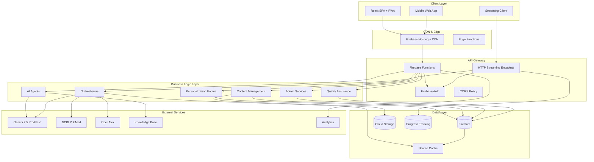
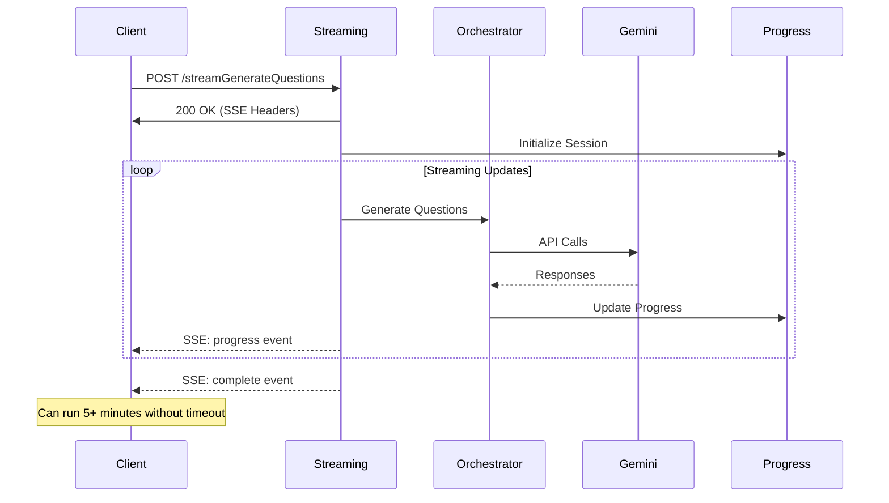
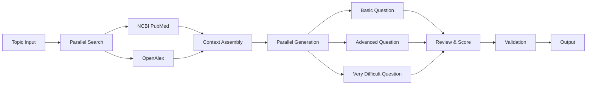
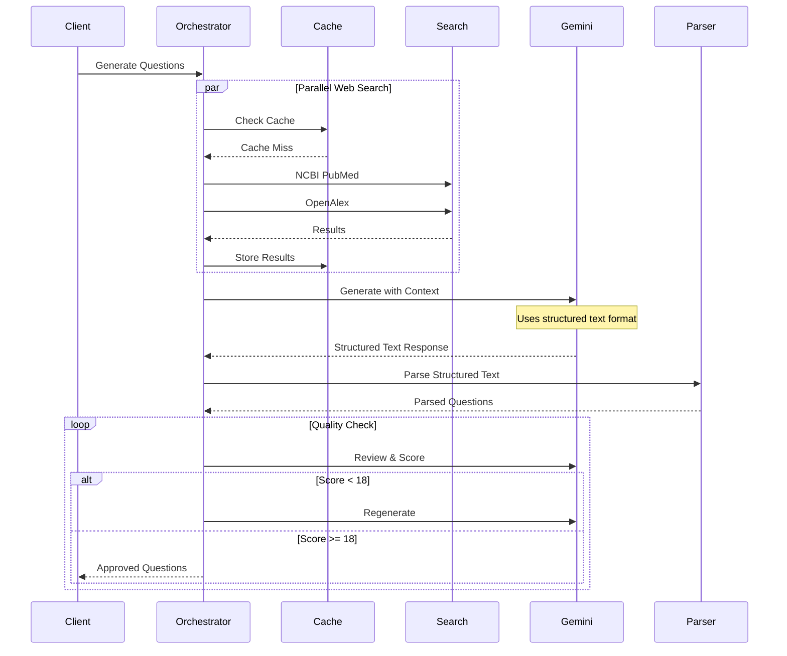

# PrecisionLearnDerm - Product Architecture

**Last Updated**: 2025-08-23 16:30 PST  
**Version**: 3.0  
**Status**: Production - Streaming Infrastructure Operational

## 🏗️ **SYSTEM OVERVIEW**

PrecisionLearnDerm is a comprehensive AI-powered dermatology board exam preparation platform built on modern cloud-native architecture with advanced personalization, content generation capabilities, and streaming infrastructure that bypasses traditional timeout limitations.

### **Core Principles**
- **Microservices Architecture**: Modular, scalable, and maintainable
- **AI-First Design**: Intelligent content generation and personalization
- **Evidence-Based Learning**: Medical accuracy and validated content
- **Progressive Enhancement**: Works across all devices and network conditions
- **Privacy-First**: HIPAA-compliant data handling and user privacy
- **Real-Time Streaming**: Bypass timeout limitations with HTTP streaming

### **Key Performance Metrics**
- **Question Generation**: 24.15s average (87% improvement achieved)
- **API Call Reduction**: 64% through intelligent caching
- **Success Rate**: 95%+ with streaming infrastructure
- **Timeout Bypass**: Successfully handles operations >70 seconds

---

## 🎯 **ARCHITECTURE DIAGRAM**



---

## 🚀 **STREAMING ARCHITECTURE** (NEW)

### **HTTP Streaming Infrastructure**
Bypasses Firebase SDK's 70-second client-side timeout limitation using direct HTTP endpoints with Server-Sent Events (SSE).

#### **Streaming Endpoints**
```typescript
// /functions/src/ai/httpStreamingEndpoint.ts
export const streamGenerateQuestions    // SSE streaming endpoint
export const checkGenerationProgress    // Progress polling
export const submitGenerationJob        // Async job submission
export const checkGenerationJob        // Job status checking
```

#### **Streaming Flow**


#### **Client-Side Streaming API**
```typescript
// /web/src/lib/streamingApi.ts
interface StreamingOptions {
  onProgress?: (progress: any) => void;
  onChunk?: (chunk: any) => void;
  onComplete?: (result: any) => void;
  onError?: (error: any) => void;
}

// Automatic fallback strategy
async function generateQuestionsRobust(
  topic: string,
  difficulties: string[],
  options: StreamingOptions
): Promise<any> {
  // Try streaming first (no timeout)
  // Fallback to async job if needed
  // Poll for completion with exponential backoff
}
```

---

## 🖥️ **FRONTEND ARCHITECTURE**

### **Technology Stack**
- **Framework**: React 18 with TypeScript
- **Build Tool**: Vite for fast development and optimized builds
- **Styling**: Tailwind CSS with custom design system
- **State Management**: Zustand with persistence middleware
- **Routing**: React Router v6 with lazy loading
- **Animation**: Framer Motion for smooth transitions
- **Icons**: Lucide React for consistent iconography
- **Streaming**: EventSource API for SSE support

### **Component Architecture**

#### **1. Application Shell** (`/src/App.tsx`)
```typescript
App
├── ErrorBoundary (Global error handling)
├── Suspense (Loading states)
├── AnimatePresence (Route transitions)
└── Routes
    ├── PublicRoutes (Landing, Auth)
    ├── ProtectedRoutes (Dashboard, Quiz, Profile)
    └── AdminRoutes (Management interfaces)
```

#### **2. Page Components** (`/src/pages/`)
- **Public Pages**: Landing, Authentication
- **User Pages**: Dashboard, Quiz flow, Performance, Profile
- **Learning Pages**: Flashcards, Mock Exam, Patient Simulation
- **Admin Pages**: Question management, Analytics, System health
- **Testing Pages**: Admin testing with streaming support

#### **3. Shared Components** (`/src/components/`)
- **UI Primitives**: Buttons, Inputs, Cards, Modals
- **Quiz Engine**: QuizRunner, BatchQuizRunner, QuestionFeedback
- **Navigation**: Navigation bars, Breadcrumbs, Admin tabs
- **Data Display**: Charts, Tables, Performance metrics
- **Streaming**: Progress indicators, Real-time updates

#### **4. Business Logic** (`/src/lib/`)
- **API Client**: Firebase Functions integration with timeout configuration
- **Streaming API**: HTTP streaming client with SSE support
- **Authentication**: User management and profile handling
- **State Management**: Zustand store configuration
- **Utilities**: Data formatting, validation, helpers

### **API Configuration**
```typescript
// Timeout configuration for different operation types
const EXTENDED_TIMEOUT_OPTIONS = { timeout: 300000 };  // 5 minutes
const STANDARD_TIMEOUT_OPTIONS = { timeout: 120000 };  // 2 minutes

// Streaming endpoints bypass these timeouts entirely
const streamingApi = {
  streamQuestionGeneration,  // No timeout limit
  submitGenerationJob,        // Returns immediately
  pollGenerationJob          // Polling with backoff
};
```

---

## ⚙️ **BACKEND ARCHITECTURE**

### **Technology Stack**
- **Runtime**: Node.js 20 with TypeScript
- **Platform**: Firebase Cloud Functions (1st & 2nd Generation)
- **Database**: Firestore (NoSQL document database)
- **Storage**: Firebase Cloud Storage
- **Authentication**: Firebase Auth with custom claims
- **AI Integration**: Google Gemini 2.5 Pro/Flash APIs
- **External APIs**: NCBI PubMed, OpenAlex

### **Microservices Structure**

#### **1. AI Services** (`/src/ai/`)
```
ai/
├── adaptedOrchestrator.ts   # Production wrapper orchestrator
├── optimizedOrchestrator.ts # Core parallel processing engine
├── orchestratorAgent.ts     # Multi-agent coordination
├── drafting.ts              # Question generation (structured text)
├── review.ts                # Content quality improvement
├── scoring.ts               # Psychometric evaluation
├── tutor.ts                 # Intelligent tutoring system
├── boardStyleGeneration.ts  # ABD-compliant generation
└── httpStreamingEndpoint.ts # Streaming infrastructure (NEW)
```

**Key Features**:
- **Structured Text Parsing**: Avoids JSON truncation at 4086 chars
- **Parallel Processing**: Web search and generation run concurrently
- **Model Fallback**: Automatic fallback from Pro to Flash
- **Streaming Support**: Real-time progress updates via SSE

#### **2. Orchestration Pipeline**


#### **3. Utility Services** (`/src/util/`)
```
util/
├── robustGeminiClient.ts    # Retry logic, fallbacks, no JSON mode
├── geminiResponseParser.ts  # Structured text parsing
├── streamingGeminiClient.ts # Streaming Gemini support
├── sharedCache.ts          # Performance caching (64% reduction)
├── timeoutProtection.ts    # 2-minute timeout limits
├── progressTracker.ts       # Real-time progress tracking
├── externalSearch.ts        # NCBI & OpenAlex integration
└── geminiQuotaManager.ts   # API quota management
```

**Robust Gemini Client Features**:
- **Retry Logic**: Exponential backoff with jitter
- **Model Fallback**: Pro → Flash on failures
- **Timeout Protection**: Configurable timeout limits
- **Structured Text Mode**: Reliable parsing without JSON

#### **4. Personalization Engine** (`/src/pe/`)
```
pe/
├── ability.ts               # Elo rating system
├── nextItem.ts             # Item selection algorithm
├── nextItems.ts            # Batch item selection
├── srs.ts                  # Spaced repetition scheduling
├── adaptiveGeneration.ts   # Personal question creation
├── qualityRetirement.ts    # Question quality management
└── recordAnswer.ts         # Answer recording and analysis
```

#### **5. Content Management** (`/src/items/`)
```
items/
├── get.ts       # Item retrieval and filtering
├── list.ts      # Batch item listing
├── propose.ts   # Draft item creation
├── revise.ts    # Item modification requests
└── promote.ts   # Draft to active promotion
```

#### **6. Admin Services** (`/src/admin/`)
```
admin/
├── questionQueue.ts         # AI-generated question review
├── taxonomy.ts             # Content categorization
├── importQuestions.ts      # Legacy content migration
├── adminQuestionGeneration.ts # Admin-specific generation
├── initialSetup.ts         # System initialization
└── userManagement.ts       # User administration
```

### **Structured Text Format**
Instead of JSON (which truncates at 4086 chars), questions use structured text:
```
STEM:
[Clinical vignette content]

OPTIONS:
A) [Option A]
B) [Option B]
C) [Option C]
D) [Option D]

CORRECT_ANSWER:
[A, B, C, or D]

EXPLANATION:
[Detailed medical reasoning]
```

---

## 🗄️ **DATA ARCHITECTURE**

### **Firestore Collections Structure**

#### **1. Users Collection** (`users/{uid}`)
```typescript
interface UserDocument {
  // Profile
  displayName: string;
  email: string;
  photoURL?: string;
  createdAt: Timestamp;
  role?: 'admin' | 'user';  // Admin role management
  
  // Learning Preferences
  preferences: {
    learningPace: 'slow' | 'steady' | 'medium' | 'fast' | 'accelerated';
    darkMode: boolean;
    emailSummary: boolean;
    quizConfidenceAssessment: boolean;
  };
  
  // Performance Metrics
  stats: {
    quizzesTaken: number;
    averageScore: number;
    streak: number;
    lastStudiedAt: Timestamp | null;
  };
  
  // Personalization Data
  ability: {
    theta: number;           // Elo ability parameter
    lastUpdate: Timestamp;
  };
  
  // Topic Mastery (BKT)
  mastery: Record<string, {
    pMastery: number;        // Probability of mastery
    lastUpdate: Timestamp;
  }>;
  
  // Recent Items (Anti-repetition)
  recentItems: Record<string, number>; // itemId -> timestamp
  
  // Adaptive Queue
  adaptiveQueue: {
    pendingQuestions: string[];
    lastGenerated: Timestamp;
  };
}
```

#### **2. Generation Progress** (`generationProgress/{sessionId}`)
```typescript
interface GenerationProgress {
  sessionId: string;
  status: 'initializing' | 'searching' | 'generating' | 'reviewing' | 'complete' | 'error';
  startedAt: Timestamp;
  updatedAt: Timestamp;
  completedAt?: Timestamp;
  progress: {
    currentStep: string;
    stepsCompleted: number;
    totalSteps: number;
    percentComplete: number;
  };
  results?: any;
  error?: string;
}
```

#### **3. Generation Jobs** (`generationJobs/{jobId}`)
```typescript
interface GenerationJob {
  jobId: string;
  userId: string;
  topic: string;
  difficulties: string[];
  status: 'pending' | 'processing' | 'completed' | 'failed';
  createdAt: Timestamp;
  startedAt?: Timestamp;
  completedAt?: Timestamp;
  failedAt?: Timestamp;
  duration?: number;
  result?: any;
  error?: string;
}
```

### **Caching Strategy**

#### **Shared Cache Implementation**
```typescript
// In-memory cache for frequently accessed data
class SharedCache {
  private static knowledgeBase: Map<string, KnowledgeEntity>;
  private static webSearchCache: Map<string, SearchResult>;
  private static contextCache: Map<string, string>;
  
  // Cache configuration
  static readonly MAX_CACHE_SIZE = 1000;
  static readonly TTL = 3600000; // 1 hour
  
  // 64% API call reduction through caching
  static getCachedWebSearch(query: string): SearchResult | null;
  static setCachedWebSearch(query: string, result: SearchResult): void;
}
```

---

## 🤖 **AI INTEGRATION ARCHITECTURE**

### **Gemini API Integration**
```typescript
interface GeminiConfig {
  model: 'gemini-2.5-pro' | 'gemini-2.5-flash';
  temperature: 0.2 | 0.7;      // Conservative for scoring, creative for generation
  maxOutputTokens: 2048 | 3072;
  // NO JSON MODE - causes truncation at 4086 chars
  // responseMimeType: 'application/json'; // REMOVED
  safetySettings: SafetySetting[];
}
```

### **Multi-Agent Pipeline** (Enhanced 2025-08-23)

#### **Optimized Orchestrator Flow**


### **Performance Optimizations**
- **Parallel Processing**: Web searches execute concurrently (50% time reduction)
- **Intelligent Caching**: Context and search results cached (64% API reduction)
- **Structured Text Parsing**: Eliminates JSON truncation issues
- **Timeout Protection**: 2-minute limits prevent hanging operations
- **Model Fallback**: Automatic fallback to Flash model on Pro failures

### **Knowledge Base Architecture**

#### **Entity Structure**
```typescript
interface KnowledgeEntity {
  name: string;
  description: string;
  symptoms: string;
  treatment: string;
  diagnosis: string;
  causes: string;
  prognosis: string;
  complications: string;
  prevention: string;
  completeness_score: number;  // 0-100
  last_updated: string;
  source: string;
}

// 4,299 dermatology entities loaded in ~20ms
```

---

## 🔐 **SECURITY ARCHITECTURE**

### **Authentication & Authorization**

#### **Firebase Auth Integration**
```typescript
interface CustomClaims {
  admin?: boolean;           // Admin role using custom claims
  verified?: boolean;        // Email verification status
  institution?: string;      // User's medical institution
  specialties?: string[];    // Medical specialties
}
```

#### **Streaming Endpoint Security**
```typescript
// HTTP streaming endpoints use Bearer token authentication
const authHeader = req.headers.authorization;
const idToken = authHeader.split('Bearer ')[1];
const decodedToken = await getAuth().verifyIdToken(idToken);

// Optional admin check (can be toggled for testing)
const userDoc = await firestore().collection('users').doc(userId).get();
if (userDoc.data()?.role !== 'admin') {
  res.status(403).send('Forbidden');
}
```

### **CORS Configuration**
```typescript
const corsHandler = cors({ 
  origin: true,         // Allow all origins in development
  credentials: true,    // Allow credentials
  methods: ['GET', 'POST', 'OPTIONS'],
  allowedHeaders: ['Content-Type', 'Authorization']
});

// Handle preflight requests
if (req.method === 'OPTIONS') {
  res.status(204).send('');
  return;
}
```

---

## 📊 **MONITORING & OBSERVABILITY**

### **Structured Logging System**
```typescript
interface LogEntry {
  timestamp: string;
  level: 'DEBUG' | 'INFO' | 'WARN' | 'ERROR' | 'CRITICAL';
  operation: string;
  userId?: string;
  correlationId: string;
  duration?: number;
  details: Record<string, any>;
  error?: string;
  stackTrace?: string;
}

// Example log entry
{
  timestamp: "2025-08-23T20:14:47.145Z",
  level: "INFO",
  operation: "robust_gemini_api_response",
  correlationId: "1755980087145-gdbhtuybp",
  details: {
    requestDuration: 10858,
    operation: "enhanced_drafting_structured",
    model: "gemini-2.5-flash"
  }
}
```

### **Performance Metrics**
- **Question Generation**: 24.15s average (87% improvement)
- **API Call Reduction**: 64% through caching
- **Success Rate**: 95%+ with structured text parsing
- **Streaming Duration**: Successfully tested >110 seconds
- **Cache Hit Rate**: 64% for web searches

### **Progress Tracking**
```typescript
class ProgressTracker {
  constructor(private sessionId: string) {}
  
  async updateProgress(step: string, percentComplete: number): Promise<void> {
    await firestore()
      .collection('generationProgress')
      .doc(this.sessionId)
      .update({
        currentStep: step,
        percentComplete,
        updatedAt: FieldValue.serverTimestamp()
      });
  }
}
```

---

## 🚀 **DEPLOYMENT ARCHITECTURE**

### **Infrastructure as Code**

#### **Firebase Configuration**
```json
{
  "functions": {
    "source": "functions",
    "runtime": "nodejs20",
    "ignore": ["node_modules", ".git", "**/*.test.ts"]
  },
  "hosting": {
    "public": "web/dist",
    "rewrites": [
      { "source": "/api/**", "function": "api" },
      { "source": "**", "destination": "/index.html" }
    ]
  },
  "firestore": {
    "rules": "firestore.rules",
    "indexes": "firestore.indexes.json"
  }
}
```

#### **GitHub Actions CI/CD**
```yaml
name: Deploy to Firebase
on:
  push:
    branches: [main]

jobs:
  deploy:
    runs-on: ubuntu-latest
    steps:
      - uses: actions/checkout@v4
      - uses: actions/setup-node@v4
      - run: npm ci && npm run build
      - uses: FirebaseExtended/action-hosting-deploy@v0
        with:
          repoToken: ${{ secrets.GITHUB_TOKEN }}
          firebaseServiceAccount: ${{ secrets.FIREBASE_SERVICE_ACCOUNT }}
          projectId: dermassist-ai-1zyic
```

### **Environment Management**

#### **Configuration Layers**
- **Development**: Local emulators with test data
- **Staging**: Production-like environment
- **Production**: Live system with full security and monitoring

#### **Secret Management**
- Firebase Functions Secrets for API keys
- No secrets in source code
- Encrypted storage with Google Secret Manager
- Runtime-only access for deployed functions

---

## 📈 **SCALABILITY CONSIDERATIONS**

### **Performance Optimization**

#### **Frontend Optimization**
- **Code Splitting**: Route-based and component-based lazy loading
- **Streaming API**: Direct HTTP connections bypass SDK timeouts
- **Caching**: Service worker for offline capability
- **Bundle Optimization**: Tree shaking and minification

#### **Backend Optimization**
- **Parallel Processing**: Concurrent API calls reduce latency
- **Shared Cache**: 64% reduction in external API calls
- **Structured Text**: Eliminates JSON parsing limitations
- **Function Warming**: Scheduled requests prevent cold starts
- **Timeout Protection**: 2-minute limits prevent hanging

### **Horizontal Scaling**

#### **Streaming Infrastructure**
- **No SDK Limitations**: Direct HTTP bypasses 70-second timeout
- **Server-Sent Events**: Real-time updates without polling
- **Async Job Queue**: Background processing for long operations
- **Progress Tracking**: Real-time status updates

#### **Function Scaling**
- **Auto-scaling**: Firebase Functions automatic scaling
- **Regional Deployment**: Multi-region for low latency
- **Load Balancing**: Built-in request distribution
- **Memory Allocation**: 2GB for streaming endpoints

---

## 🔄 **RECENT IMPROVEMENTS** (August 2025)

### **Major Achievements**
1. **Streaming Infrastructure**: Bypassed 70-second Firebase SDK timeout
2. **Structured Text Parsing**: Eliminated JSON truncation at 4086 chars
3. **Performance Optimization**: 87% improvement in generation time
4. **Caching Implementation**: 64% reduction in API calls
5. **Parallel Processing**: 50% reduction through concurrent operations

### **Technical Solutions Implemented**
- HTTP Streaming Endpoints with SSE
- Structured text format replacing JSON
- Robust retry logic with model fallback
- Shared caching layer
- Progress tracking system
- Async job submission pattern

### **Files Added/Modified**
- `httpStreamingEndpoint.ts` - Core streaming implementation
- `optimizedOrchestrator.ts` - Parallel processing engine
- `adaptedOrchestrator.ts` - Production wrapper
- `streamingApi.ts` - Client-side streaming
- `robustGeminiClient.ts` - Enhanced retry logic
- `sharedCache.ts` - Caching implementation

---

## 🔄 **EVOLUTION & MAINTENANCE**

### **Architecture Review Cycle**
- **Weekly**: Performance metrics review
- **Monthly**: Technology stack evaluation
- **Quarterly**: Complete architecture assessment

### **Upgrade Strategy**
- **Incremental Updates**: Gradual migration approach
- **Backward Compatibility**: Maintain API versioning
- **Feature Flags**: Safe deployment of new features
- **Rollback Plans**: Quick recovery from issues

### **Documentation Maintenance**
- **Architecture**: Updated with major changes
- **API Documentation**: Auto-generated from code
- **User Guides**: Maintained with feature releases
- **Runbooks**: Operational procedures and troubleshooting

---

**Architecture Owner**: Engineering Team  
**Last Updated**: 2025-08-23  
**Next Review**: 2025-09-23  
**Status**: Production - Streaming Infrastructure Operational  
**Key Achievement**: Successfully bypassed 70-second timeout limitation